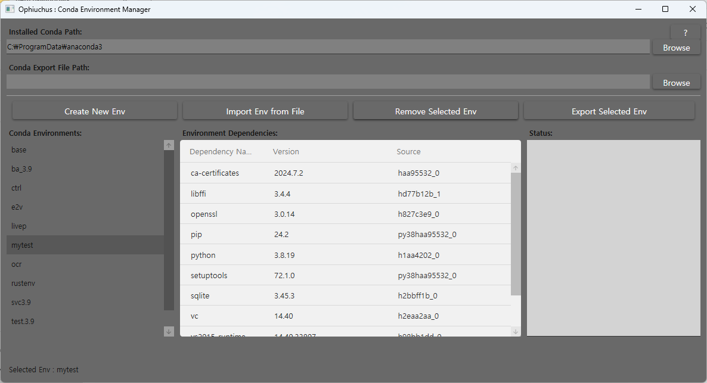
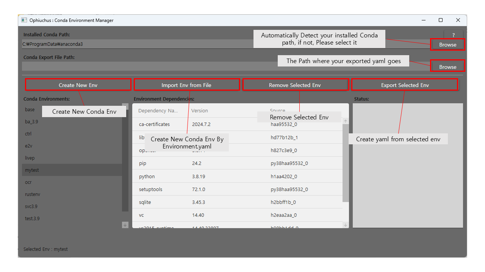
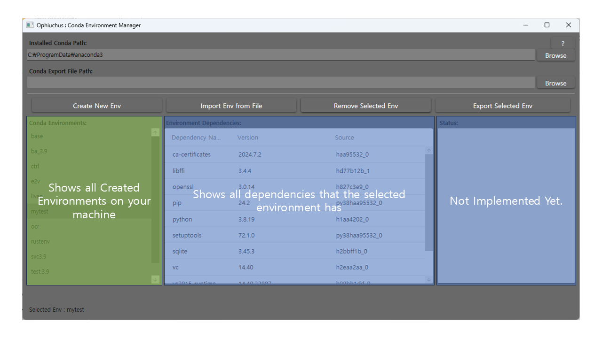

## Ophiuchus : Conda Environment Manager for windows

### Conda Env Manager in Single Windows Machine 

#### What you can do is

1. See what env is created on your local machine.
2. See what env has dependencies
3. Create New Environment
4. Remove Existed Environment
5. Create Environments.yaml on selected location
6. Export Selected env as Environments.yaml
7. Open new Activated cmd windows by double clicking Environments

---

#### Basic Layout

